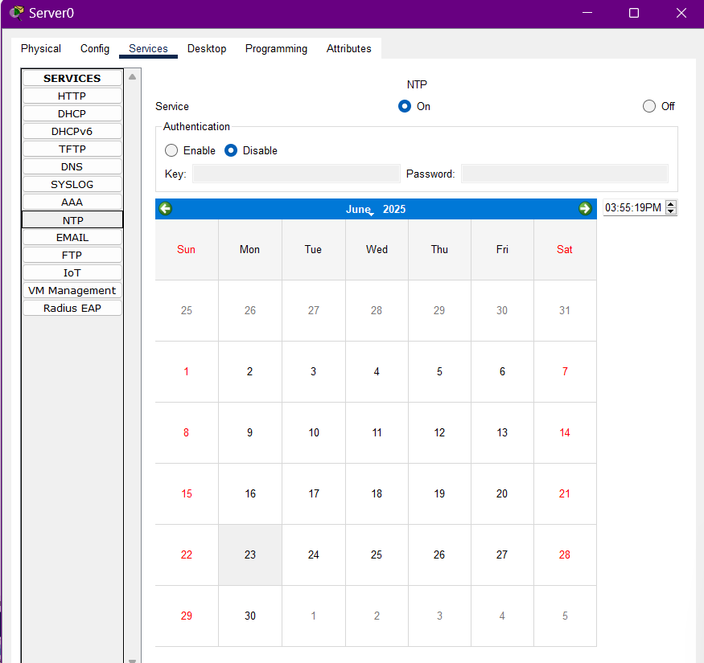
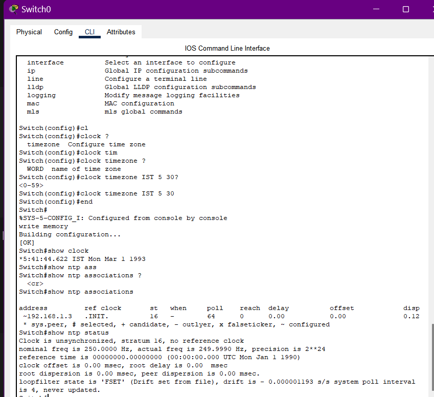

# ⏰ NTP Server Configuration (Cisco Packet Tracer)

Network Time Protocol (NTP) ensures accurate and synchronized time across network devices such as routers, switches, and servers. This is crucial for logs, certificates, and time-sensitive processes.

---

## 🖥️ Topology Overview

```
Switch ---- Server (NTP)
   |
   PC
```

---

## 🔧 Step 1: Configure the NTP Server

1. **Open the Server.**
2. Go to the `Config` tab → Select the `FastEthernet` interface.

   * Assign IP: `192.168.1.2`
   * Subnet Mask: `255.255.255.0`
3. Go to the `Services` tab → Click on `NTP`.

   * Toggle **NTP Service** to `ON`.
   * Set the **current date and time** manually.

📸 *Sample Interface:*

> 

---

## ⚙️ Step 2: Configure the Switch/Router (Client)

1. Open the CLI tab of the **Switch** or **Router**.
2. Enter the following commands:

```bash
enable
configure terminal
clock timezone IST 5 30     # Optional: Set your timezone
ntp server 192.168.1.2      # IP of the NTP Server
end
write memory
```

---

## ✅ Step 3: Verification Commands

Use these commands on the router/switch CLI to verify:

```bash
show clock                      # Displays current time
show ntp associations           # Checks NTP server link
show ntp status                 # Displays sync status
```

📸 *NTP Unsynchronized Router*

> 

📸 *NTP Synchronized Router*

> 
---

## 📌 Notes

* Make sure the devices are **properly connected and powered ON**.
* **Authentication** can be enabled for more secure setups (optional in Packet Tracer).
* Ensure devices are **in the same subnet** or routing is configured properly if on different networks.

---

## 🧠 Summary

| Device        | Configuration                            |
| ------------- | ---------------------------------------- |
| Server        | IP: 192.168.1.2 + NTP Service ON         |
| Switch/Router | NTP Server: 192.168.1.2 + Timezone Setup |

Time sync is now active across your network! 🕒
